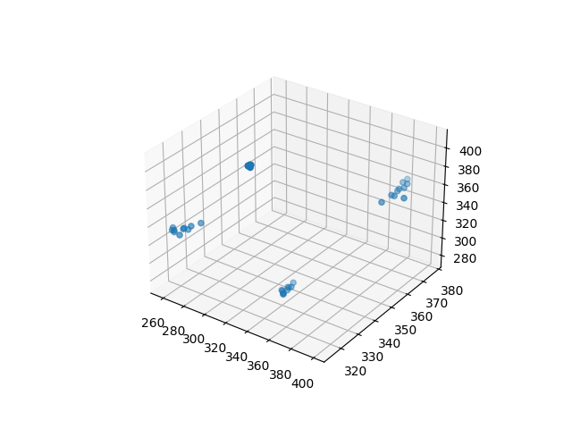

# Tietoliikenteen Sovellusprojekti
Vuoden 2022 tietoliikenteen sovellusprojekti
 
 
# Arkkitehtuurikuva

# Arduinon toiminta
## Komponentit (Lähettäjä)
- GY-61 Kiihtyvyysanturi
- Arduino
- RWS-371 Vastaanotin
- TWS-BS Lähetin

## Arduinon koodi mittamissen ja lähettämiseen
> Koodi koostuu pääohjelmasta ja kahdesta luokasta (accelerator ja messaging).
> 
> Accelerator luokkaa käytetään mittausten tekemiseen ja sen tallentamiseen Measurement nimiseen struktiin, jossa on sisällä x,y,z arvot.
>
> Messaging luokkaa käytään datan muokkamiseen lähetettävään muotoon ja datan lähettämiseen sekä varmistusviestin vastaanottamiseen. createMessage metodissa x,y,z arvoista muodostetaan jokaisesta 2 high bittiä ja 8 low bittiä jotta data saadaan siirrettyä.
>
> Pääohjelmassa määritetään mittausten määrä sekä missä asennossa mittaukset tehdään käyttäjän inputin mukaan. Asento sijoitetaan flags nimiseen muuttujaan hexadecimaalina, joka lähetetään myös tietokantaan.

# Python
## Tiedon hakeminen tietokannasta
> Tiedon sain haettua monella eri tapaa, jotka ovat:
> - requests (Datahaku.py ja Datahaku3.py)
> - mysql.connector (Datahaku2.py)
> - TCP-socket (TCPSocketClient.py)

> Käytin Datahaku2.py:tä lopullisen tiedon hakemiseen, joka syötetään k-means:ille. Tein näin, koska requests:illa tiedon sai helpoiten ja muiden ratkaisujen kanssa oli ongelmia esim: 
> - TCPSocketClient.py:llä ei saanut kaikkea tietoa tietokannasta
> - Datahaku2.py:llä sain kaiken tiedon tietokannasta, mutta sen oli turhan sotkuinen

## K-means algoritmi
> Heti ensimmäisenä sarakkeet 5,6 ja 7 (x,y,z) haetaan data.csv nimisestä tiedostosta, johon tietokannan tiedot tallennettiin Datahaku2.py:llä. 
 

